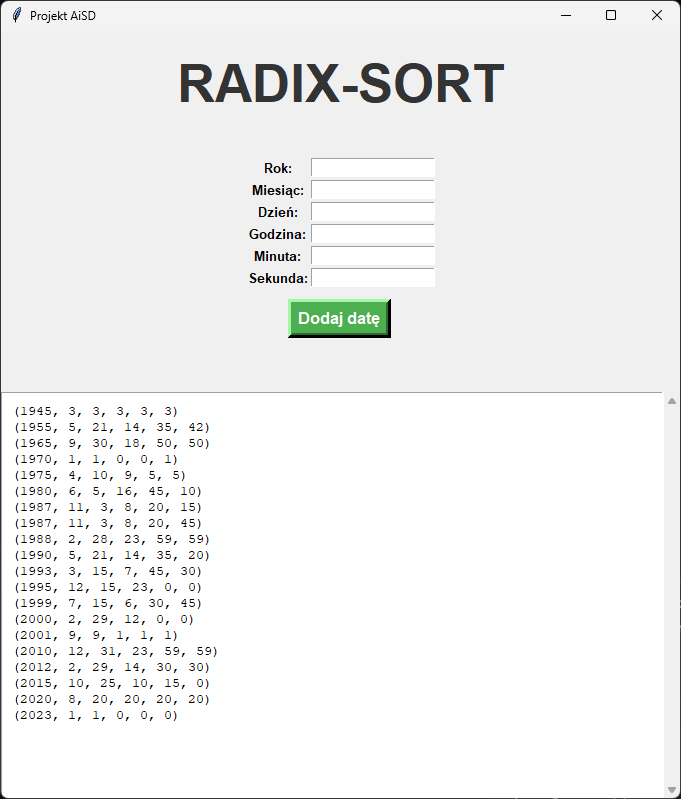

# Radix-Sort Date Visualizer

A Python application that visualizes the Radix Sort algorithm applied to date and time objects. 
Built as a project for the "Algorithms and Data Structures" course.

## Features
- **Radix Sort Implementation:** Custom implementation of Radix Sort using stable Counting Sort.
- **Robust Validation:** Handles leap years, varied month lengths, and future date prevention.
- **Interactive GUI:** Built with Tkinter, allowing real-time data entry and instant sorting.

## How it works
The algorithm sorts dates from the least significant field (seconds) to the most significant (years).

## Authors
- Kamil Homziuk (Validation, GUI, Data handling)
- Marek Gozdalski (Sorting logic, Scrollbar, GUI Alerts)
